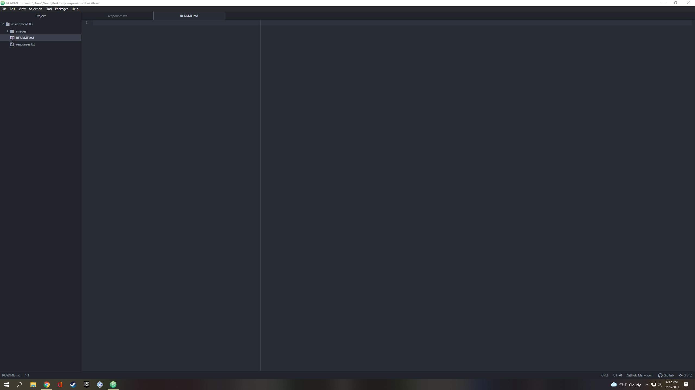

# Assignment 3
## Noah Baney
1. A DNS translates a hostname into an IP address so that humans to not have to memorize long IP address numbers when browsing the web.
2. There are absolute URLs which contain all of the protocols and information for a file's location and relative URLs that contain no protocols or domain information because they are referencing files within the same path.
3. Markup languages are systems used for annotating a document in a way that is syntactically distinguishable from the text.

[ESPN](https://www.espn.com)

[My Responses](./responses.txt)

