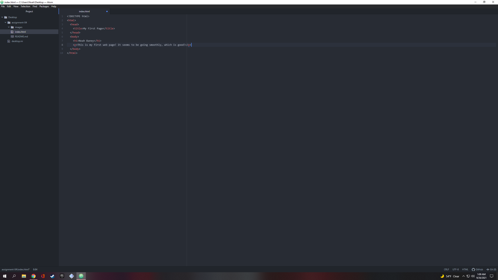

A web browser, essentially, retrieves information from other parts of the web and displays it on your desktop or mobile device's screen. The browser that I use when I'm surfing on my iPhone or Macbook is Safari, mostly because that is the IOS operating system's default browser and gets the job done. When I'm doing more intricate work on my PC I browse with Google Chrome.

Markup language is a system for annotating a document that is distinguishable from the content and is only used to format the text, so that the processed document does not display it. HTML or Hypertext Markup Language is a common markup language used in web developed.

