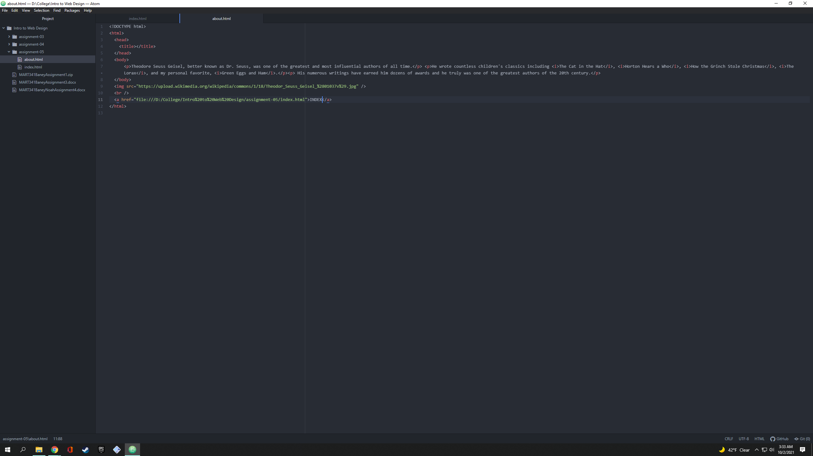

1. I took a look at the Amazon homepage from the year 2005 using The Way Back Machine. The main differences were the aesthetics. The website looked very basic with blocky lettering and blue hyperlinks everywhere. The homepage from 2005 also featured mostly text, while today's version of the homepage bombards you with pictures for clothing or whatever other recent items you have purchased, which is a great marketing tactic used by Amazon. Actually viewing a picture for an item draws the customer in even more.
2. Over the last few topics, I have learned that there are multiple methods for web development, not just html. I am really starting to make connections in my head when I'm viewing web pages about what that might look like in html code. I enjoyed the simplicity of markdown, but am really starting to get the hang of html and am enjoying it more than markdown now. I did have a bit of difficulty inserting links, but ultimately figured it out.
3. 
